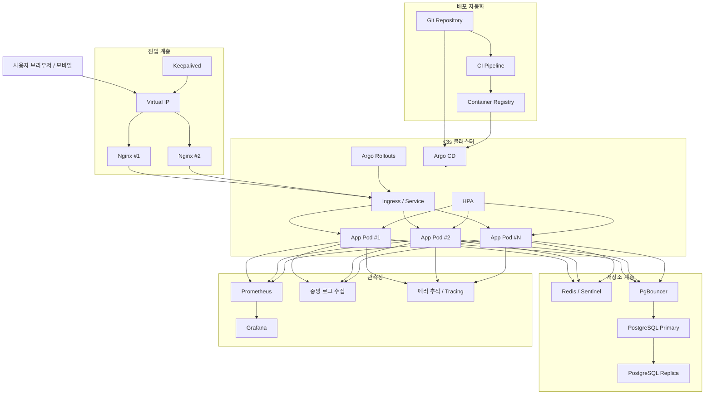
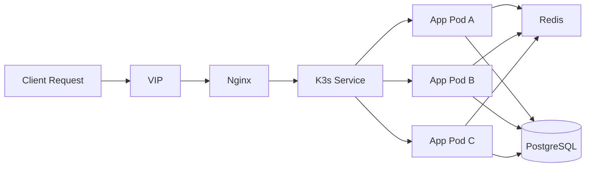

# PERFO 인프라 아키텍처 가이드

> 이 문서는 인프라, 배포, 확장, 고가용성 전략만 다룬다.  
> 티켓팅 요청 처리 방식과 상태 전파 규칙은 [REQUEST_PROCESSING_STRATEGY.md](./REQUEST_PROCESSING_STRATEGY.md)에서 분리해서 관리한다.

## 목차

1. [문서 범위](#1-문서-범위)
2. [인프라 개요](#2-인프라-개요)
3. [기술 선택 이유](#3-기술-선택-이유)
4. [배포 전략](#4-배포-전략)
5. [스케일링 전략](#5-스케일링-전략)
6. [단계별 다중화 전략](#6-단계별-다중화-전략)
7. [데이터 저장소 전략](#7-데이터-저장소-전략)
8. [관측성 전략](#8-관측성-전략)
9. [장애 복구 전략](#9-장애-복구-전략)
10. [CI/CD 및 배포 자동화](#10-cicd-및-배포-자동화)
11. [IaC 전략](#11-iac-전략)
12. [카나리 배포 운영 원칙](#12-카나리-배포-운영-원칙)
13. [보안과 운영](#13-보안과-운영)
14. [용량 계획](#14-용량-계획)
15. [관련 문서](#15-관련-문서)

## 1. 문서 범위

이 문서는 아래 질문에 답하기 위한 문서다.

- 시스템을 어디에 배포하는가
- 요청을 어떤 인프라 계층에서 분산하는가
- 장애를 어떻게 버티고 복구하는가
- 배포 자동화와 카나리 배포를 어떻게 운영하는가

이 문서에 포함하지 않는 내용:

- 티켓팅 요청 처리 순서
- 재고 차감 로직
- SSE 상태 값과 전파 규칙
- A/B 테스트 지표 수집 규칙

위 내용은 애플리케이션 처리 전략 문서로 분리한다.

## 2. 인프라 개요

PERFO는 온프레미스 환경을 기본 전제로 하며, 다음 구조를 기준으로 인프라를 설계한다.

- 외부 진입 계층: `Nginx + Keepalived`
- 애플리케이션 오케스트레이션: `K3s`
- 애플리케이션 배포: `Argo CD`
- 점진 배포: `Argo Rollouts`
- 캐시 및 상태 저장소: `Redis`
- 영속 데이터 저장소: `PostgreSQL`

핵심 방향은 다음과 같다.

- 단일 서버 운영에서 시작하되, 다중 인스턴스 확장으로 자연스럽게 넘어갈 수 있어야 한다.
- 배포 자동화는 필수이며, 운영 서버 수작업 접속 배포를 피한다.
- 티켓팅과 티켓 검증 UX 실험을 위해 카나리 배포를 지원해야 한다.
- 앱만 늘리는 구조가 아니라, Redis와 PostgreSQL도 단계적으로 다중화할 수 있어야 한다.

### 2.1 현재 권장 최소 구성

- 개인 프로젝트 초기 단계에서는 단일 서버 또는 소형 VM 1대를 기준으로 시작한다.
- 기본 구성은 `Nginx + App + PostgreSQL + Redis` 정도로 단순화한다.
- 배포는 우선 `Docker Compose` 같은 단순한 방식으로 시작할 수 있다.
- 이 단계에서는 고가용성보다 백업, 복구, 로그 확인, 재배포 편의성이 더 중요하다.

### 2.2 확장 목표 구성

- 서비스 규모가 커지면 `Nginx + Keepalived + K3s + Argo CD + Argo Rollouts + Redis + PostgreSQL` 구조로 확장한다.
- 다중 인스턴스, 카나리 배포, 관측성, 저장소 다중화는 이 목표 구성에서 본격적으로 적용한다.
- 즉 현재는 작게 운영하고, 문서는 확장 가능한 목표 구조를 함께 관리하는 방식으로 본다.

### 2.3 목표 인프라 구조도

### 2.4 목표 요청 분산 구조도

## 3. 기술 선택 이유

### 3.1 Nginx

- 정적 자산 처리, 리버스 프록시, TLS 종료를 한 계층에서 안정적으로 처리할 수 있다.
- SSE 연결 프록시 운영 경험과 자료가 많다.
- 온프레미스 환경에서 가장 무난하게 채택할 수 있는 진입 계층이다.

### 3.2 Keepalived

- 온프레미스에는 클라우드 L/B가 없으므로 가상 IP 기반 이중화가 필요하다.
- Nginx 인스턴스 장애 시 VIP를 빠르게 넘겨 서비스 진입점을 유지할 수 있다.

### 3.3 K3s

- 배포 자동화, 수평 확장, 롤링 업데이트, 장애 복구가 필요하다.
- 풀 Kubernetes는 현재 프로젝트 규모 대비 운영 부담이 크다.
- K3s는 Kubernetes 호환성을 유지하면서도 온프레미스에서 더 가볍게 운영 가능하다.

### 3.4 Argo CD

- Git을 배포 기준점으로 삼아 선언형으로 운영 상태를 관리할 수 있다.
- 수작업 배포보다 추적성과 롤백 가능성이 높다.

### 3.5 Argo Rollouts

- 이 프로젝트는 A/B 테스트를 위해 일부 사용자에게만 신규 버전을 점진적으로 노출해야 한다.
- Argo Rollouts는 카나리 비율 조절, 단계적 확장, 롤백 판단을 운영 체계 안에서 다룰 수 있게 한다.

### 3.6 PostgreSQL

- 티켓팅 시스템은 정합성과 트랜잭션 안정성이 중요하다.
- 중복 구매 방지, 구매 이력 저장, 상태 조회처럼 제약조건과 일관성이 중요한 작업에 적합하다.

### 3.7 Redis

- 빠른 조회, 캐시, 임시 상태 저장, 다중 인스턴스 간 상태 공유에 적합하다.
- 추후 Pub/Sub, 분산 락, 세션 저장소 등으로도 확장할 수 있다.

## 4. 배포 전략

### 4.1 온프레미스 기본 배포 구조

- `Nginx` 2대 이상
- `Keepalived`로 VIP 구성
- `K3s` 클러스터에 앱 배포
- `Redis`, `PostgreSQL`는 별도 저장소 계층으로 운영

### 4.2 개인 프로젝트 현실 배포안

- 초기에는 단일 서버 또는 단일 VM 배포를 허용한다.
- 이 단계에서는 `Nginx`, 애플리케이션, `PostgreSQL`, `Redis`를 한 호스트에 둘 수 있다.
- 목표는 고가용성보다 빠른 배포와 운영 단순성이다.
- 트래픽과 운영 난이도가 증가할 때 `Keepalived`, `K3s`, 저장소 분리를 순차적으로 도입한다.

### 4.3 요청 진입 흐름

1. 클라이언트 요청은 VIP를 통해 Nginx로 들어온다.
2. Nginx는 K3s Ingress 또는 Service 계층으로 요청을 전달한다.
3. K3s는 여러 Pod 중 하나로 요청을 분산한다.
4. 앱은 Redis와 PostgreSQL 같은 공용 저장소를 사용한다.

### 4.4 운영 원칙

- 애플리케이션 인스턴스는 가능하면 stateless하게 유지한다.
- 세션, 임시 상태, 이벤트 공유는 공용 저장소 기반으로 설계한다.
- 운영 배포 기준은 브랜치가 아니라 버전 태그와 매니페스트 상태다.

## 5. 스케일링 전략

### 5.1 요청 분산

- 외부 HTTP 요청 분산은 Nginx가 담당한다.
- K3s 내부에서는 Service가 여러 Pod로 요청을 분산한다.

### 5.2 애플리케이션 스케일링

- 기본 스케일링 단위는 애플리케이션 Pod 수다.
- 필요 시 `K3s HPA`를 통해 Pod 수를 자동 조절할 수 있다.
- 단, 앱만 늘리면 Redis와 PostgreSQL이 병목이 될 수 있으므로 저장소 계층도 함께 고려해야 한다.

### 5.3 스케일링 전제 조건

- 세션을 특정 앱 인스턴스 메모리에 두지 않는다.
- 공용 저장소 기반의 인증/상태 전략을 사용한다.
- 다중 인스턴스 환경에서도 동일한 상태를 볼 수 있어야 한다.

## 6. 단계별 다중화 전략

### 6.1 1단계: 단일 인스턴스 운영

- `Nginx 1대`, `App 1대`, `Redis 1대`, `PostgreSQL 1대`
- 목적은 기능 검증과 초기 운영 경험 확보
- 이 단계에서는 백업, 복구 절차, 모니터링 기준부터 정리한다.

### 6.2 2단계: 앱 계층 이중화

- `Nginx + Keepalived`, `App 2대 이상`, `Redis 1대`, `PostgreSQL 1대`
- 목적은 앱 장애 대응과 무중단 배포 기반 확보
- 이 단계부터 앱 상태를 메모리에 두지 않는 구조가 필수다.

### 6.3 3단계: Redis 다중화

- `Redis Sentinel` 기반 장애 감지와 Failover 도입
- 목적은 캐시, 세션, 상태 공유 계층의 단일 장애점 제거

### 6.4 4단계: PostgreSQL 읽기 복제

- `PostgreSQL Primary + Replica`
- 목적은 조회 부하 분산과 백업/복구 안정성 향상
- 핵심 쓰기 경로는 Primary 기준으로 유지한다.

### 6.5 5단계: PostgreSQL 고가용성

- 필요 시 `Patroni` 같은 HA 구성을 검토
- 목적은 DB 장애 시 서비스 중단 시간 단축
- Failover, split-brain 방지, connection routing까지 함께 설계해야 한다.

### 6.6 6단계: 대규모 확장

- `K3s HPA` 기반 앱 자동 확장
- Redis는 `Sentinel`을 넘어 `Cluster` 또는 역할 분리까지 검토
- PostgreSQL은 읽기/쓰기 분리와 운영 자동화 강화
- 오픈 시간대 피크가 커지면 Kafka 같은 비동기 계층도 별도 검토

## 7. 데이터 저장소 전략

### 7.1 PostgreSQL

- 영속 데이터의 단일 진실 원본으로 사용한다.
- 운영 초기에는 단일 Primary로 시작하고, 이후 Replica와 HA를 단계적으로 도입한다.

### 7.2 PostgreSQL 연결 관리

- K3s에서 Pod 수가 늘어나면 DB connection 수도 함께 증가하므로 연결 풀 전략이 필요하다.
- 필요 시 `PgBouncer` 같은 풀링 계층을 두고, 앱 인스턴스 수와 DB 연결 상한을 함께 관리한다.

### 7.3 PostgreSQL 읽기/쓰기 분리 기준

- 티켓 발급, 재고 반영, 결제 연계처럼 정합성이 중요한 작업은 Primary를 사용한다.
- 통계, 목록, 이력 조회처럼 약간의 지연을 허용할 수 있는 읽기 작업은 Replica를 검토한다.
- 최신성이 중요한 조회는 Replica 지연 영향을 받지 않도록 Primary 고정 기준을 둔다.

### 7.4 Redis

- 캐시, 임시 상태, 인스턴스 간 상태 공유 계층으로 사용한다.
- 역할이 늘어날수록 단일 인스턴스 Redis의 리스크가 커지므로 Sentinel 또는 역할 분리를 준비한다.

### 7.5 Redis 역할 분리 기준

- 캐시, 세션, Pub/Sub, 락을 한 Redis에 모두 올릴 수는 있지만 장기적으로 리스크가 커진다.
- 초기에는 단일 Redis로 시작할 수 있으나, 부하와 중요도에 따라 역할 분리를 검토한다.
- 상태 전파나 락이 캐시 eviction 영향으로 흔들리면 안 되므로 중요 역할은 우선 분리 대상이다.

### 7.6 저장소 다중화 원칙

- 앱보다 저장소 다중화가 늦어도 되지만, 영원히 늦으면 안 된다.
- 앱 다중화 이후에도 저장소가 단일 인스턴스면 그 지점이 병목이자 SPOF가 된다.

## 8. 관측성 전략

### 8.1 메트릭

- 배포 자동화와 카나리 운영을 하려면 메트릭 수집이 거의 필수다.
- 기본 조합은 `Prometheus + Grafana`를 기준으로 한다.
- 앱 응답 시간, 에러율, Pod 리소스, Redis 메모리, PostgreSQL TPS와 connection 수를 지속적으로 본다.

### 8.2 로그

- 앱 로그, Nginx 접근 로그, 배포 로그는 중앙 수집 기준을 둔다.
- 개별 서버 접속 후 로그를 읽는 방식만으로는 다중 인스턴스 운영과 장애 분석이 어렵다.

#### 8.2.1 로그 수집 대상

- 애플리케이션 로그
- Nginx 접근 로그와 에러 로그
- K3s 이벤트와 컨테이너 stdout/stderr
- Argo CD, Argo Rollouts 배포 로그
- PostgreSQL, Redis 주요 운영 로그

#### 8.2.2 로그 관리 원칙

- 로그는 가능한 한 구조화된 형태로 남긴다.
- 요청 단위 추적을 위해 `request id`, `user id`, `deployment version`, `pod name` 같은 상관 필드를 포함한다.
- 다중 인스턴스 환경에서는 서버별 파일 로그보다 중앙 검색 기준이 우선이다.

#### 8.2.3 보관과 검색

- 장애 분석에 필요한 보존 기간을 먼저 정의하고 그 기준에 맞춰 저장한다.
- 운영 로그와 감사 로그는 검색 가능해야 하며, 버전과 시간대 기준으로 필터링할 수 있어야 한다.
- 카나리 배포 중에는 안정 버전과 신규 버전 로그를 구분해서 볼 수 있어야 한다.

#### 8.2.4 민감정보 마스킹

- 토큰, 비밀번호, 주민번호, 카드 정보 같은 민감정보는 로그에 남기지 않는다.
- 개인정보가 필요한 경우에도 최소한으로 남기고, 마스킹 규칙을 일관되게 적용한다.

#### 8.2.5 감사 로그

- 관리자 기능, 권한 변경, 강제 취소, 검증 상태 변경 같은 민감 작업은 일반 앱 로그와 별도로 감사 로그 기준을 둔다.
- 감사 로그는 누가, 언제, 어떤 작업을 했는지 추적 가능해야 한다.

### 8.3 에러 추적과 트레이싱

- 예외 추적 도구를 통해 배포 버전별 오류를 구분할 수 있어야 한다.
- 분산 구간이 늘어나면 요청 단위 추적을 위한 tracing 도입을 검토한다.

## 9. 장애 복구 전략

### 9.1 복구 목표

- DB와 Redis 각각에 대해 `RTO`와 `RPO`를 정의해야 한다.
- 장애 발생 시 몇 분 안에 복구할지, 몇 분의 데이터 손실을 허용할지 운영 기준을 명시한다.

### 9.2 백업과 복구

- PostgreSQL은 정기 백업과 복원 테스트를 운영 절차에 포함한다.
- Redis는 용도에 따라 영속성 설정, 스냅샷, 복구 기준을 분리해서 본다.
- 백업이 있어도 실제 복구 리허설이 없으면 전략으로 보기 어렵다.

### 9.3 장애 리허설

- DB 장애, Redis 장애, 배포 실패를 가정한 복구 리허설을 주기적으로 수행한다.
- 운영 문서에는 장애 탐지, Failover, 복구 확인, 서비스 정상화 순서를 남긴다.

## 10. CI/CD 및 배포 자동화

### 10.1 CI

- 테스트 실행
- 이미지 빌드
- 컨테이너 레지스트리 업로드

### 10.2 CD

- Git 저장소의 배포 매니페스트를 기준으로 클러스터 상태를 동기화
- 수작업 서버 접속 배포를 피하고, Git 변경 이력 중심으로 운영

### 10.3 배포 기준

- 운영 배포는 버전 태그와 Git 매니페스트 기준으로 식별 가능해야 한다.
- 롤백은 이전 정상 버전으로 명확히 되돌릴 수 있어야 한다.

## 11. IaC 전략

### 11.1 왜 IaC를 사용하는가

- 이 프로젝트는 Nginx, Keepalived, K3s, Redis, PostgreSQL, Argo CD 같은 관리 포인트가 많다.
- 운영자가 직접 서버에 접속해 설정을 바꾸는 방식은 환경 드리프트와 복구 난이도를 키운다.
- IaC를 사용하면 인프라 변경 이력을 Git으로 관리하고, 신규 서버 구성과 장애 복구를 반복 가능하게 만들 수 있다.

### 11.2 역할 분담

| 도구 | 주 역할 | 이 프로젝트에서의 사용 범위 |
| --- | --- | --- |
| Terraform | 인프라 자원 생성 | VM, 네트워크, 스토리지, DNS, 가상 자원 생성 |
| Ansible | 서버 프로비저닝과 설정 | Nginx, Keepalived, K3s, Redis, PostgreSQL, PgBouncer 설치와 설정 |
| Argo CD | 클러스터 내부 배포 동기화 | K3s 내부 애플리케이션, Ingress, 운영 컴포넌트 배포 |
| Helm | 쿠버네티스 배포 패키징 | 앱과 운영 컴포넌트 매니페스트 템플릿 관리 |

### 11.3 Ansible 역할

- 운영체제 기본 설정
- 패키지 설치와 서비스 설정
- Nginx, Keepalived, K3s, Redis, PostgreSQL, PgBouncer 설치
- 환경 파일, 인증서, 서비스 유닛, 권한 설정 배포
- 서버 역할별 설정 차등 적용

### 11.4 운영 원칙

- 인프라 생성은 가능한 한 Terraform으로 관리한다.
- 생성된 서버를 실제 운영 가능 상태로 만드는 과정은 Ansible로 관리한다.
- K3s 내부 리소스와 애플리케이션 배포는 Argo CD가 관리한다.
- 운영자가 직접 서버에 접속해 변경하는 행위는 예외 상황으로만 제한한다.

## 12. 카나리 배포 운영 원칙

- 이 프로젝트는 A/B 테스트를 운영하기 위해 카나리 배포를 채택한다.
- 목적은 일부 사용자에게만 신규 버전을 제한적으로 노출하는 것이다.
- 카나리 배포는 실험 대상 노출과 운영 안정성 확인을 동시에 만족시키는 수단이다.
- 배포 비율과 실험군 할당 방식은 같은 개념이 아니므로 분리해서 설계한다.
- 카나리 배포를 하더라도 SSE 이벤트 포맷과 핵심 API 계약은 호환성을 유지해야 한다.

## 13. 보안과 운영

### 13.1 보안 기본 원칙

- HTTPS 강제
- 내부 서비스 격리
- 환경변수와 Secret 관리 체계화
- Rate Limiting 적용

### 13.2 보안 세부 항목

- Secret은 코드와 분리해 관리하고 접근 권한을 최소화한다.
- 관리자 기능은 일반 사용자 영역과 분리된 인증/인가 기준을 둔다.
- 감사 로그는 관리자 기능과 보안 민감 기능 중심으로 남긴다.
- 외부 공개 범위와 공격 표면이 커지면 WAF 필요성을 검토한다.
- Rate Limit은 로그인, 티켓팅, 검증, 관리자 API별로 따로 정의한다.

### 13.3 데이터 보존과 개인정보

- 티켓, 결제, 로그인, 접속 로그의 보존 기간을 정의한다.
- 개인정보는 가능한 범위에서 마스킹하거나 분리 저장한다.
- 삭제 요청, 탈퇴 처리, 보존 만료 데이터 정리 기준을 운영 정책에 반영한다.

### 13.4 운영 기본 원칙

- 백업과 복구 절차를 문서화한다.
- 저장소 장애와 배포 실패에 대한 롤백 기준을 준비한다.
- 모니터링, 로그 수집, 에러 추적 체계를 별도로 마련한다.

## 14. 용량 계획

- 현재 개인 프로젝트 단계에서는 과도한 서버 스펙보다 단순 운영 가능한 최소 구성이 우선이다.
- 목표 아키텍처 기준 용량 계획과 현재 운영 스펙은 별도로 봐야 한다.
- 티켓 오픈 피크 기준 동시 접속자 수를 가정해야 한다.
- 목표 `RPS`, 동시 `SSE` 연결 수, Redis 메모리 한도, PostgreSQL TPS 목표치를 정의해야 한다.
- 앱 Pod 수만 늘리는 방식이 아니라 저장소와 네트워크까지 함께 계산해야 실제 아키텍처가 된다.
- 카나리 배포 시에도 기준 버전과 신규 버전이 동시에 자원을 사용하므로 여유 용량을 별도로 확보해야 한다.

## 15. 관련 문서

- [요청 처리 전략](./REQUEST_PROCESSING_STRATEGY.md)
- [PWA 푸시 알림 가이드](../PWA_PUSH_GUIDE.md)
- [윈도우 서버 배포 가이드](../WINDOWS_SERVER_GUIDE.md)
