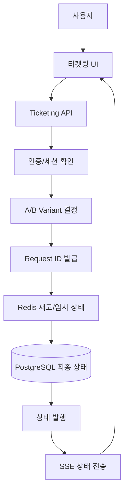
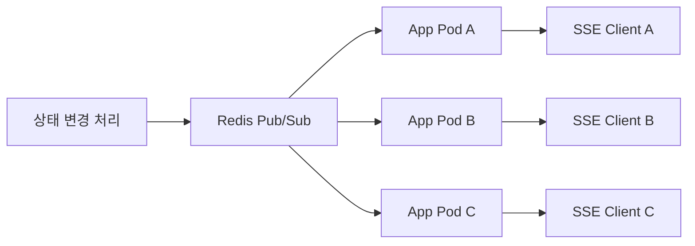

# PERFO 요청 처리 전략 가이드

> 이 문서는 티켓팅 요청 처리 로직, 상태 전파 방식, 세션/인증 전략, A/B 테스트 운영 규칙처럼 애플리케이션 전략만 다룬다.  
> 인프라, 배포, 확장, 다중화는 [ARCHITECTURE.md](./ARCHITECTURE.md)에서 관리한다.

## 목차

1. [문서 범위](#1-문서-범위)
2. [요청 처리 개요](#2-요청-처리-개요)
3. [도메인 경계](#3-도메인-경계)
4. [데이터 저장 전략](#4-데이터-저장-전략)
5. [정합성 기준과 실패 복구](#5-정합성-기준과-실패-복구)
6. [티켓팅 상태 전략](#6-티켓팅-상태-전략)
7. [세션과 인증 상태 전략](#7-세션과-인증-상태-전략)
8. [SSE 적용 이유](#8-sse-적용-이유)
9. [SSE 다중 인스턴스 상태 전파](#9-sse-다중-인스턴스-상태-전파)
10. [QR 검증 전략](#10-qr-검증-전략)
11. [분산 락과 중복 처리](#11-분산-락과-중복-처리)
12. [관리자 기능과 권한 모델](#12-관리자-기능과-권한-모델)
13. [A/B 테스트 운영 전략](#13-ab-테스트-운영-전략)
14. [API 계약과 도메인 이벤트 모델](#14-api-계약과-도메인-이벤트-모델)
15. [Kafka 마이그레이션 전략](#15-kafka-마이그레이션-전략)
16. [추가 고려 사항](#16-추가-고려-사항)

## 1. 문서 범위

이 문서는 아래 질문에 답하기 위한 문서다.

- 티켓팅 요청을 어떤 순서로 처리하는가
- 재고와 발급 결과를 어디에 저장하는가
- 상태를 사용자에게 어떻게 전달하는가
- 인증과 세션 상태를 어떻게 관리하는가
- A/B 테스트를 어떤 원칙으로 운영하는가
- 언제 Kafka로 넘어갈 것인가

## 2. 요청 처리 개요

### 2.1 요청 처리 구조도

### 2.2 티켓 발급 정책

- 이벤트별 총 발행 수량 정의
- 중복 구매 허용 여부 정의
- 사용자별 최대 구매 수량 정의

### 2.3 요청 처리 흐름

1. API 서버가 티켓팅 요청을 수신한다.
2. 요청 단위 식별자를 발급한다.
3. Redis에서 재고를 확인하고 차감한다.
4. PostgreSQL 트랜잭션으로 구매 이력과 발급 결과를 저장한다.
5. DB에 최종 상태가 확정되면 상태 발행 계층을 통해 SSE로 클라이언트에 전달한다.

### 2.4 처리 원칙

- 사용자 중복 요청을 방지할 수 있어야 한다.
- 재고 차감과 발급 결과 저장의 정합성을 유지해야 한다.
- 실패 시 사용자에게 현재 상태를 명확하게 전달해야 한다.
- 최종 상태 확정은 반드시 PostgreSQL 기준으로 판단해야 한다.

## 3. 도메인 경계

### 3.1 핵심 경계

- `Ticketing`: 재고 차감, 구매 요청, 발급 결과 확정
- `Verification`: QR 검증, 사용 처리, 검증 이력 관리
- `Notification`: 푸시 알림, 상태 알림, 메시지 발송 요청
- `Admin Operations`: 조회, 재처리, 운영 개입, 감사 추적

### 3.2 경계 설계 원칙

- 관리자 기능은 티켓팅 핵심 경계와 분리 가능한 형태로 설계한다.
- 알림은 티켓팅 결과를 소비하는 별도 경계로 유지한다.
- 검증 기능은 티켓 발급과 연결되지만 독립된 상태 변경 경계로 본다.

## 4. 데이터 저장 전략

### 4.1 Redis 역할

- 재고 차감
- 임시 상태 저장
- 다중 인스턴스 환경에서의 상태 공유 기반

### 4.2 PostgreSQL 역할

- 최종 티켓 발급 결과 저장
- 구매 이력 관리
- 중복 구매 제한과 수량 제한 검증
- 상태 조회의 기준 데이터 제공

## 5. 정합성 기준과 실패 복구

### 5.1 최종 진실 원본

- 재고와 발급 결과의 최종 진실 원본은 `PostgreSQL`이다.
- Redis는 빠른 처리와 임시 상태 관리를 위한 보조 계층으로 사용한다.
- Redis와 DB 상태가 어긋나면 DB를 기준으로 복구한다.

### 5.2 실패 복구 원칙

- 복구는 무조건 자동 복구를 우선한다.
- 관리자 개입은 자동 복구가 실패했을 때만 최후의 보루로 사용한다.

### 5.3 대표 실패 시나리오

- `Redis 차감 성공 + DB 저장 실패`: DB 기준으로 재고 복구 또는 상태 재처리
- `DB 저장 성공 + SSE 전송 실패`: 상태는 이미 확정된 것으로 보고 SSE 재전송 또는 polling fallback
- `중복 요청 재시도`: 같은 idempotency key면 기존 처리 결과 반환

## 6. 티켓팅 상태 전략

### 6.1 상태 값 예시

- `PENDING`
- `PROCESSING`
- `SUCCESS`
- `FAILED`
- `SOLD_OUT`
- `DUPLICATE`

### 6.2 상태 관리 원칙

- 상태 값은 프론트와 백엔드가 동일한 계약으로 관리해야 한다.
- 상태 전이는 명확해야 하며, 같은 요청이 서로 다른 최종 상태를 가지면 안 된다.
- 실패 상태도 재시도 가능 여부를 포함해 사용자에게 해석 가능해야 한다.

## 7. 세션과 인증 상태 전략

- 인증 방식은 `JWT` 중심으로 간다.
- 앱 스케일링을 전제로 할 때 인증 상태를 특정 인스턴스 메모리에 두지 않는다.
- 강제 로그아웃과 토큰 폐기 기능은 제공하되, 운영자가 정말 필요한 상황에서만 제한적으로 사용한다.
- 관리자 기능과 일반 사용자 인증은 같은 인증 수단을 쓰더라도 권한 검증 기준을 분리한다.
- 세션 저장소를 Redis에 둘 경우 만료, 갱신, 강제 무효화 규칙을 명확히 해야 한다.

## 8. SSE 적용 이유

- 티켓팅 상태는 서버에서 클라이언트로 보내는 단방향 알림이 대부분이다.
- Polling보다 불필요한 반복 요청을 줄일 수 있다.
- WebSocket보다 구현과 운영이 단순하다.

### 통신 전략

| 기능 | 방식 | 이유 |
| --- | --- | --- |
| 티켓팅 상태 | SSE | 실시간 단방향 상태 push |
| 이벤트/티켓 목록 | Polling | 갱신 빈도 낮음 |
| QR 검증 | HTTP | 단발성 요청 |

## 9. SSE 다중 인스턴스 상태 전파

### 9.1 상태 전파 구조도

- 앱이 여러 Pod로 늘어나면 사용자가 어느 인스턴스에 붙든 동일한 상태를 받아야 한다.
- 이를 위해 Redis Pub/Sub 같은 공용 상태 전파 계층을 사용한다.
- SSE 연결은 각 인스턴스가 들고 있더라도, 상태 변경 이벤트는 공용 채널을 통해 받아 동일하게 전달해야 한다.
- 특정 인스턴스 메모리에만 상태가 있으면 스케일링과 장애 복구 시 일관성이 깨진다.
- SSE 연결 실패 시에는 polling fallback을 허용한다.

### 9.2 Polling fallback 정책

- SSE 재연결이 3회 연속 실패하면 polling fallback으로 전환한다.
- 서버 에러와 네트워크 에러는 동일하게 보지 않는다.
- 서버 에러는 서버 상태 이상 가능성을 우선 의심하고, 네트워크 에러는 클라이언트 연결 문제로 본다.
- 일반 목록 조회 fallback polling 주기는 3초로 둔다.
- 티켓팅 상태 조회 fallback polling 주기는 1초로 둔다.
- polling 중에도 SSE 복귀는 주기적으로 재시도한다.
- SSE 복귀 재시도는 exponential backoff를 적용한다.
- 클라이언트가 네트워크 정상화를 감지하면 SSE 복귀를 다시 시도한다.
- fallback 전환과 복귀는 사용자에게 별도 노출하지 않고 내부적으로 처리한다.
- 이 정책은 서버 부하보다 상태 정확도를 우선한다.

## 10. QR 검증 전략

- QR에는 `ticketId`, `eventId`, `userId`, 서명 정보를 포함한다.
- 위변조 방지를 위해 HMAC 또는 동등한 서명 방식을 사용한다.
- 모바일 스캐너는 QR을 읽은 뒤 서버 검증 API에 유효성을 확인한다.

## 11. 분산 락과 중복 처리

- 티켓팅은 같은 사용자의 중복 요청과 재시도를 기본적으로 고려해야 한다.
- 요청 단위 `idempotency key`를 도입하고, 같은 key면 기존 결과를 재사용한다.
- 재고 차감과 경쟁 조건이 겹치는 구간은 Redis 기반 분산 락 또는 동등한 제어 전략을 검토한다.
- 락은 무조건 도입하는 것이 아니라, DB 제약조건과 함께 어느 계층에서 일관성을 보장할지 기준을 먼저 정해야 한다.

## 12. 관리자 기능과 권한 모델

### 12.1 관리자 경계

- 관리자 기능은 티켓팅 핵심 처리 경계와 분리 가능한 형태로 설계한다.
- 관리자 개입이 핵심 처리 로직을 직접 덮어쓰지 않도록 별도 운영 경로를 둔다.

### 12.2 권한 모델

- `운영 관리자`: 조회, 상태 확인, 재처리 요청
- `시스템 관리자`: 운영 관리자 권한 + 시스템 수준 설정과 복구 권한

### 12.3 개입 범위

- 관리자는 조회와 재처리만 허용한다.
- 상태 수동 수정은 기본적으로 허용하지 않는다.

## 13. A/B 테스트 운영 전략

- 이 프로젝트는 티켓팅과 티켓 검증 UX를 지속적으로 개선하기 위해 A/B 테스트를 운영한다.
- 같은 사용자는 실험 기간 동안 동일한 variant를 유지해야 한다.
- 티켓팅 진행 중에는 variant가 바뀌면 안 된다.
- 구매 완료율, 대기열 이탈률, 검증 소요 시간, 오류율 같은 지표를 variant별로 수집해야 한다.
- 카나리 배포는 A/B 테스트를 위한 사용자 노출 수단으로 활용한다.

### 13.1 실험 플랫폼 설계 기준

- variant 할당 기준은 `userId`로 고정한다.
- 실험 종료 기준과 롤백 기준을 배포 전에 정의한다.
- 지표 수집 방식은 이벤트 로그, 서버 로그, 분석 테이블 중 무엇을 기준으로 볼지 먼저 정한다.
- 안정성 지표와 UX 지표를 분리해서 판단해야 한다.

### 13.2 실험 종료 우선순위

- `전환율 차이`
- `운영 리스크`
- `오류율`
- `기간`

## 14. API 계약과 도메인 이벤트 모델

### 14.1 API 계약 전략

- API 계약은 호환성을 최대한 유지하면서 점진적으로 변경한다.
- 프론트와 백엔드 계약 변경 시 기존 클라이언트가 즉시 깨지지 않도록 점진 전환을 우선한다.

### 14.2 도메인 이벤트 모델

- 상태 변경은 공통 도메인 이벤트로 정의한다.
- 예시:
  - `TicketingRequested`
  - `TicketIssued`
  - `TicketingFailed`
  - `VerificationCompleted`
  - `NotificationRequested`
- 이 모델은 푸시, 로그 적재, 분석 이벤트, Kafka 도입 시 공통 기반으로 사용한다.

## 15. Kafka 마이그레이션 전략

### 15.1 Kafka 도입 시점

- API 서버가 직접 처리하기 어려울 정도로 동시 요청이 급증할 때
- 재고 확인과 발급 처리 지연보다 순간 피크가 훨씬 클 때
- 다수 애플리케이션 인스턴스 간 처리량 평준화와 비동기 재처리가 필요할 때

### 15.2 마이그레이션 단계

1. 현재 요청 처리 로직을 `request intake`, `inventory check`, `ticket persistence`, `status publish` 경계로 분리
2. Outbox 또는 경량 큐 진입점 추가
3. Kafka Producer/Consumer 도입
4. 실패 재처리와 파티셔닝 전략 설계

### 15.3 마이그레이션 원칙

- Kafka 도입 전후에도 요청 ID 기반 상태 조회 계약은 유지해야 한다.
- SSE 상태 발행 로직은 가능하면 동일한 인터페이스를 유지해야 한다.
- 사용자에게 보이는 요청 처리 흐름은 최대한 바꾸지 않는다.

## 16. 추가 고려 사항

- 운영 Runbook은 추후 별도 문서로 정리한다.
- 비용 계획과 장기 보관 정책은 서비스 규모가 커질 때 더 구체화한다.
