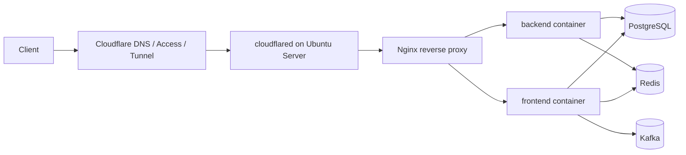
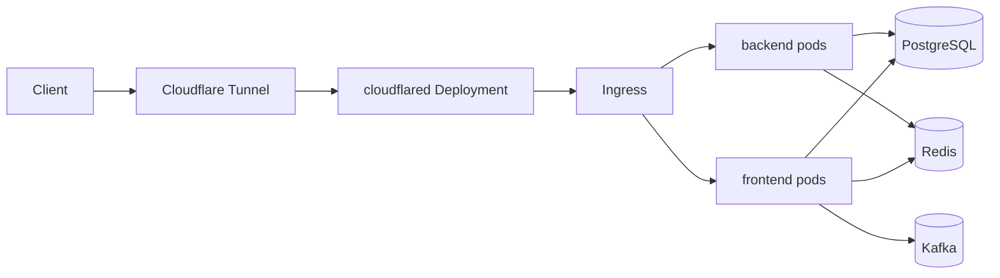

# PERFO Ubuntu Server CI/CD 및 오토스케일링 운영 계획

> 대상 환경:
> 미니 PC 1대 + Ubuntu Server + Docker Compose + Cloudflare Tunnel
>
> 이 문서는 현재 운영 현실에 맞는 배포 구조를 먼저 정리하고,
> 이후 `K3s + HPA + KEDA` 기반 확장으로 넘어가는 경로까지 함께 정의한다.

## 1. 문서 목표

- 현재 미니 PC 서버에 안정적으로 배포할 수 있는 `CI/CD` 구조를 정한다.
- `Cloudflare Tunnel`을 사용하는 외부 공개 구조를 운영 기준으로 정리한다.
- 단일 서버에서 가능한 범위의 리소스 탄력 운영 방식을 정한다.
- 진짜 의미의 오토스케일링이 필요한 시점에 어떤 구조로 넘어갈지 문서화한다.

## 2. 전제와 제약

### 2.1 현재 전제

- 운영 서버는 `Ubuntu Server`가 설치된 미니 PC 1대다.
- 외부 공개는 `Cloudflare Tunnel`을 사용한다.
- 애플리케이션 런타임은 현재 저장소 기준 `Docker Compose`를 사용한다.
- 서비스 구성은 `frontend`, `backend`, `postgres`, `redis`, `kafka`, `zookeeper`다.

### 2.2 중요한 제약

- 단일 미니 PC에서는 클라우드처럼 노드가 자동으로 늘어나지 않는다.
- 따라서 현재 단계의 오토스케일링은 "같은 서버 안에서 컨테이너 수와 자원 배분을 조절"하는 수준이다.
- 미니 PC의 CPU, 메모리, 디스크 IOPS가 전체 확장 한계다.
- `Cloudflare Tunnel`은 외부 진입을 안정화하지만, origin 서버 자원을 자동으로 늘려주지는 않는다.

## 3. 권장 운영 아키텍처

### 3.1 1단계 권장 구조



### 3.2 역할 분리 기준

- `cloudflared`
  - 외부에서 들어오는 요청을 서버 내부 서비스로 안전하게 전달한다.
  - 80/443 포트를 직접 외부에 열지 않아도 되는 구조를 유지한다.
- `Nginx`
  - 내부 라우팅, 헬스체크, 향후 블루/그린 전환 지점을 담당한다.
  - 단일 서버라도 `cloudflared -> app` 직접 연결보다 `cloudflared -> nginx -> app` 구조가 운영 유연성이 높다.
- `Docker Compose`
  - 현재 운영 단계를 가장 단순하게 유지하는 기본 실행 계층이다.
- `PostgreSQL`, `Redis`, `Kafka`
  - 현재는 같은 호스트에서 시작하되, 트래픽 증가 시 가장 먼저 분리 대상이 된다.

## 4. CI/CD 설계 원칙

- `CI`와 `CD`를 분리한다.
- CI는 `GitHub-hosted runner`에서 실행한다.
- 운영 서버는 빌드 서버가 아니라 배포 대상 서버로만 쓴다.
- 서버에 장기 실행형 `self-hosted runner`를 두는 방식은 초기에는 피한다.
- 이미지는 `GHCR` 같은 컨테이너 레지스트리에 저장한다.
- 배포는 `SSH + pull + health check + rollback` 절차로 시작한다.

## 5. 권장 CI 파이프라인

### 5.1 트리거

- Pull Request 생성/수정
- `main` 브랜치 merge
- 수동 운영 배포 `workflow_dispatch`

### 5.2 CI 단계

1. 프론트엔드 의존성 설치
2. 프론트엔드 lint, unit test, build
3. 백엔드 test 실행
4. Docker 이미지 build
5. 이미지 취약점 스캔
6. 이미지 태깅
7. GHCR push

### 5.3 권장 이미지 태그 정책

- `frontend:<git-sha>`
- `backend:<git-sha>`
- 선택적으로 `frontend:main`, `backend:main`
- 운영 롤백용으로 최근 `N`개 SHA 태그를 유지한다.

### 5.4 CI 성공 기준

- 프론트엔드 테스트 통과
- 백엔드 테스트 통과
- 이미지 빌드 성공
- 최소 1회 컨테이너 부팅 검증 성공

## 6. 권장 CD 파이프라인

### 6.1 가장 현실적인 1단계 CD

`GitHub Actions -> SSH -> Ubuntu Server -> docker compose pull -> docker compose up -d`

이 구조가 현재 환경에서는 가장 단순하고 운영 난이도가 낮다.

### 6.2 배포 순서

1. `main` merge 또는 수동 배포 실행
2. GitHub Actions가 새 이미지 SHA를 확정
3. 운영 서버에 SSH 접속
4. 배포 전 DB 백업 스크립트 실행
5. `docker compose pull frontend backend`
6. `docker compose up -d frontend backend`
7. `/health` 또는 애플리케이션 헬스 엔드포인트 검사
8. 실패 시 직전 SHA로 rollback

### 6.3 운영 서버 권장 디렉토리 구조

```text
/opt/perfo/
  compose/
    docker-compose.yml
    .env.prod
  scripts/
    deploy.sh
    rollback.sh
    backup-db.sh
    health-check.sh
  releases/
    release-manifest.json
  backups/
```

### 6.4 배포 스크립트가 해야 할 일

- 새 이미지 pull
- 현재 실행 중인 이미지 태그 저장
- 컨테이너 교체
- 헬스체크 재시도
- 실패 시 이전 태그로 복구
- 배포 로그 기록

## 7. 무중단에 가까운 배포 전략

### 7.1 초기 단계

- 단일 컨테이너 재기동 기반 배포를 허용한다.
- 짧은 중단이 허용 가능하면 가장 단순하다.

### 7.2 운영 안정화 단계

- `frontend_blue`, `frontend_green`
- `backend_blue`, `backend_green`
- `Nginx upstream` 전환

위 구조로 가면 단일 서버에서도 블루/그린 배포가 가능하다.

### 7.3 왜 Nginx를 중간에 두는가

- `Cloudflare Tunnel` 대상은 고정된 내부 엔드포인트가 좋다.
- 블루/그린 전환은 `Nginx upstream`만 바꾸는 식이 가장 단순하다.
- 직접 `cloudflared`가 개별 컨테이너 포트를 바라보게 하면 전환이 번거롭다.

## 8. 오토스케일링 전략

### 8.1 핵심 판단

- 현재 서버 1대에서는 "진짜 인프라 오토스케일링"이 아니라 "앱 계층 탄력 운영"이 맞다.
- 따라서 1단계에서는 `자원 제한`, `복제본 수 조정`, `예약 스케일링`이 핵심이다.
- 이후 추가 노드가 생기면 그때 `K3s HPA/KEDA`를 붙여 진짜 수평 확장으로 넘어간다.

### 8.2 1단계: Docker Compose 기반 탄력 운영

- `frontend`, `backend`에 CPU/메모리 제한 설정
- `healthcheck` 설정
- `restart: unless-stopped` 적용
- 로그 로테이션 적용
- 피크 시간대에 수동 또는 스케줄 기반 `--scale` 적용

예시 운영 방향:

- 평시: `frontend=1`, `backend=1`
- 이벤트 오픈 전후: `frontend=2`, `backend=2`
- 야간: 다시 `frontend=1`, `backend=1`

단, Compose 수평 확장은 앞단 프록시와 헬스체크가 같이 설계되어야 의미가 있다.

### 8.3 1단계에서 꼭 같이 해야 할 자원 정책

- `postgres`는 메모리 보호 대상이다.
- `redis`는 eviction 정책과 persistence 기준을 분리해야 한다.
- `kafka`는 메모리 사용량이 큰 편이므로 미니 PC에서 과도한 복제본 확장은 피한다.
- `frontend`보다 `backend`를 먼저 늘리는 편이 효과적일 가능성이 높다.

### 8.4 1단계 예약 스케일링

이벤트 오픈 시간이 정해져 있다면 자동 임계치 기반보다 예약 스케일링이 더 실용적이다.

예시:

- 오픈 30분 전: `backend=2`, `frontend=2`
- 오픈 직후 1시간: `backend=3`
- 안정화 이후: 원복

이 작업은 `systemd timer` 또는 `cron`으로 운영할 수 있다.

## 9. 2단계 오토스케일링 전환안

### 9.1 전환 시점

아래 중 2개 이상이 반복되면 `Docker Compose`만으로는 운영 한계에 가까운 것이다.

- 피크 시간 CPU가 장시간 70% 이상 유지
- 메모리 압박으로 OOM이 발생
- 배포 중 중단 시간이 운영상 문제
- 동일 서비스 복제본을 자주 수동 조정
- 이벤트 시점마다 운영자 개입이 필수

### 9.2 전환 구조

`Ubuntu Server 단일 노드 K3s -> 이후 다중 노드 K3s`

### 9.3 K3s 도입 후 얻는 것

- Deployment 기반 롤링 업데이트
- readiness/liveness probe
- HPA 기반 자동 복제본 조정
- namespace 단위 격리
- GitOps 확장성

### 9.4 K3s + Cloudflare Tunnel 권장 구조



## 10. 3단계 진짜 수평 확장 구조

### 10.1 필요 조건

- 미니 PC 2대 이상 또는 별도 VM/서버 추가
- K3s multi-node 구성
- 공용 네트워크와 고정 내부 주소 체계
- 저장소 계층 분리 또는 전용 노드 배치

### 10.2 이 단계에서 가능한 오토스케일링

- `HPA`로 CPU/메모리 기반 Pod 자동 확장
- `KEDA`로 Kafka lag, queue depth 기반 이벤트 드리븐 확장
- 워크로드별 노드 배치

### 10.3 이 단계에서도 남는 현실 제약

- 온프레미스는 하드웨어가 자동 생성되지 않는다.
- 즉 Pod는 늘릴 수 있어도, 노드가 꽉 차면 더 이상 자동 확장되지 않는다.
- 진짜 인프라 자동 확장을 원하면 예비 노드가 항상 준비되어 있거나 클라우드 자원을 병행해야 한다.

## 11. 저장소 계층 확장 원칙

### 11.1 PostgreSQL

- 처음에는 단일 인스턴스로 시작한다.
- 백업 자동화가 앱 오토스케일링보다 먼저다.
- 앱 복제본이 늘어나면 DB connection 수가 먼저 병목이 될 수 있다.
- `PgBouncer` 도입을 차기 우선순위로 둔다.

### 11.2 Redis

- 세션, 캐시, 락, pub/sub를 모두 넣으면 단일 장애점이 된다.
- 초기는 단일 Redis로 가능하지만, 중요도가 올라가면 역할 분리를 고려한다.

### 11.3 Kafka

- 미니 PC 단일 노드에서는 고가용성 메시징 계층으로 보기 어렵다.
- 현재는 기능성 비동기 계층으로만 보고, 내결함성 요구가 생기면 별도 노드 분리를 검토한다.

## 12. 관측성과 스케일링 판단 기준

### 12.1 최소 수집 항목

- 호스트 CPU 사용률
- 호스트 메모리 사용률
- 디스크 사용률 및 I/O wait
- 컨테이너별 CPU/메모리
- Nginx 4xx/5xx 비율
- backend 응답 시간
- DB connection 수
- Redis 메모리 사용률
- Kafka lag

### 12.2 권장 도구

- 1단계: `node-exporter`, `cAdvisor`, `Prometheus`, `Grafana`
- 로그: `Loki` 또는 외부 로그 수집기
- 가벼운 업타임 체크: `Uptime Kuma`

### 12.3 스케일링 트리거 예시

- backend CPU 70% 이상 10분 지속
- p95 응답 시간 임계치 초과
- DB connection 사용률 80% 초과
- Kafka consumer lag 지속 증가

## 13. 보안과 운영 원칙

- `cloudflared`는 `systemd` 서비스로 운영한다.
- SSH는 키 기반 인증만 허용한다.
- 운영 서버 배포 계정은 최소 권한으로 제한한다.
- Docker registry credential은 루트 홈이 아니라 배포 전용 계정 영역에 둔다.
- 운영용 `.env.prod`는 저장소에 두지 않고 서버 비밀 저장 영역에서 관리한다.
- GitHub Actions용 SSH 키와 서버용 배포 키는 분리한다.

## 14. 단계별 실행 계획

### 14.1 바로 적용할 1차 작업

1. Ubuntu 서버에 `cloudflared`, `docker`, `docker compose`, `nginx`를 systemd로 정리한다.
2. `Nginx -> frontend/backend` 라우팅을 고정한다.
3. GitHub Actions CI를 만들고 프론트/백 테스트 및 이미지 빌드를 자동화한다.
4. GHCR push 후 SSH 배포 스크립트로 CD를 붙인다.
5. DB 백업과 헬스체크, 롤백 스크립트를 만든다.
6. 최소 모니터링을 붙인다.

### 14.2 2차 작업

1. 블루/그린 배포 구조 도입
2. 예약 스케일링 적용
3. DB connection 관리 기준 수립
4. 로그/메트릭 대시보드 정리

### 14.3 3차 작업

1. K3s 단일 노드 전환
2. HPA 적용
3. KEDA 적용 여부 검토
4. 추가 미니 PC 또는 VM을 worker로 연결

## 15. 최종 권장안 요약

- 지금 당장은 `Cloudflare Tunnel + Nginx + Docker Compose + GHCR + GitHub Actions SSH 배포`가 가장 현실적이다.
- 현재 미니 PC 1대에서는 `자원 제한 + 예약 스케일링 + 복제본 조정`이 실질적인 오토스케일링이다.
- 진짜 자동 수평 확장이 필요하면 `K3s + HPA + KEDA + 추가 노드`로 넘어가야 한다.
- 저장소 계층은 앱보다 늦게 확장할 수는 있어도, 영원히 단일 인스턴스로 둘 수는 없다.
