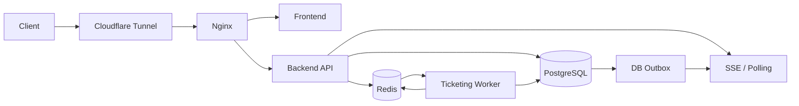

# 온프레미스 미니PC 기준 고부하 처리 구현 계획

> 기준 문서:
> `docs/01_Design/00_Architecture/04_REQUEST_PROCESSING_STRATEGY.md`
> `docs/02_Development/00_Plan/03_INFRA_PLAN.md`
> `docs/02_Development/00_Plan/08_UBUNTU_SERVER_CICD_AUTOSCALING_PLAN.md`
>
> 특히 `04_REQUEST_PROCESSING_STRATEGY.md`의 `17. 부하 대응 아키텍처 기준`을 티켓팅, QR 토큰 발급, QR 검증 구현의 기본 기준으로 사용한다.

## 1. 문서 목적

- 현재 운영 서버가 클라우드 오토스케일링 환경이 아니라 단일 온프레미스 미니PC라는 전제를 구현 계획에 반영한다.
- 티켓팅, QR 발급, QR 검증처럼 순간 부하가 몰리는 경로를 앱 Pod 증설만으로 해결하지 않는다.
- 요청 진입, 중복 제거, 진입 제어, 큐잉, 재고 처리, DB 확정, 상태 전파를 분리해 병목을 제어한다.
- Kafka 도입 전 `Redis Stream` 또는 `DB outbox`로 버틸 수 있는 구조를 먼저 만든다.
- 실제 용량은 벤치마크로 확정하되, 구현 초기에 필요한 보수적 운영 기준을 문서화한다.

## 2. 현재 서버 사양

사용자 제공 장비 이미지 기준으로 확인한 장비 사양:

```text
Model: T8PLUS
CPU: Intel N100
RAM: 16GB
ROM: 512GB
Input: 12V / 2.5A
Manufacturer: 피코플러스
```

운영 전 추가 확인이 필요한 값:

- OS: Ubuntu Server 버전
- 디스크 종류: SATA SSD, NVMe, eMMC 여부
- 디스크 실제 IOPS와 fsync 지연
- 네트워크: 유선 LAN 속도, 공유기, Cloudflare Tunnel 사용 여부
- 냉각 상태와 장시간 부하 시 thermal throttling 여부
- UPS 또는 정전 복구 정책

## 3. 하드웨어 제약 해석

Intel N100 + RAM 16GB 단일 노드는 MVP 운영과 소규모 이벤트에는 적합하지만, 대규모 피크를 직접 흡수하는 서버로 보면 한계가 명확하다.

중요 제약:

- CPU core 수가 제한적이므로 동시 요청을 모두 앱 스레드에서 처리하면 쉽게 포화된다.
- PostgreSQL, Redis, App, Nginx, cloudflared, 선택적으로 Kafka까지 한 노드에 같이 있으면 메모리 경쟁이 발생한다.
- 512GB 저장소는 용량보다 쓰기 지연, fsync, WAL, 로그 증가가 더 중요하다.
- 단일 노드 장애는 곧 전체 서비스 장애다.
- 따라서 처리량보다 `정합성`, `backpressure`, `degrade`, `복구 가능성`을 우선한다.

## 4. 기본 운영 원칙

- PostgreSQL은 최종 진실 원본이다.
- Redis는 재고 선차감, rate limit, 임시 상태, 짧은 TTL 캐시, Pub/Sub, Redis Stream에 사용한다.
- API 서버는 피크 순간에 모든 발급 처리를 동기 처리하지 않는다.
- 티켓팅 요청 접수와 실제 발급 처리를 분리한다.
- QR 검증 성공 처리는 DB 조건부 업데이트로 보호한다.
- 푸시, 로그, 분석, 알림은 핵심 트랜잭션에서 분리한다.
- 신규 접수 제한과 기존 상태 조회는 분리한다.
- 과부하 시 사용자가 반복 클릭하게 만드는 모호한 실패를 반환하지 않는다.

## 5. 권장 1단계 구성



권장:

- Docker Compose 기반으로 시작한다.
- Kafka는 초기 필수 구성에서 제외하거나 매우 제한적으로 둔다.
- 티켓팅 피크 대응은 먼저 `Redis Stream` 또는 `DB outbox`로 구현한다.
- Kafka는 Redis Stream/DB outbox가 처리량, 재처리, consumer lag, 보관 요구를 감당하지 못할 때 도입한다.

## 6. 티켓팅 요청 처리 계획

### 6.1 접수와 발급 처리 분리

티켓팅 API는 다음 두 단계를 분리한다.

1. 요청 접수
   - 인증 확인
   - idempotency key 확인
   - rate limit/admission control 확인
   - 요청 상태를 `PENDING` 또는 `PROCESSING`으로 저장
   - Redis Stream 또는 outbox에 처리 요청 적재
   - `requestId` 반환

2. 실제 발급 처리
   - Worker가 큐에서 요청을 가져온다.
   - Redis 재고 원자 차감 또는 DB 조건부 확정을 수행한다.
   - PostgreSQL 트랜잭션으로 최종 결과를 저장한다.
   - outbox 이벤트를 기록한다.
   - SSE/Polling/Notification 경로로 상태를 전달한다.

API 응답 예시:

```json
{
    "requestId": "req_20260429_abc",
    "status": "PROCESSING",
    "retryAfterMs": 1000
}
```

### 6.2 Idempotency key 설계

쓰기 API는 `Idempotency-Key`를 필수로 받는다.

권장 key 범위:

```text
userId:eventId:clientGeneratedKey
```

저장 필드:

- `idempotency_key`
- `user_id`
- `event_id`
- `request_id`
- `request_hash`
- `status`
- `response_snapshot`
- `created_at`
- `expires_at`

규칙:

- 같은 key와 같은 request hash면 기존 `requestId`와 상태를 반환한다.
- 같은 key인데 request body가 다르면 `409 CONFLICT`로 거부한다.
- `SUCCESS`, `FAILED`, `SOLD_OUT`, `DUPLICATE`도 저장한다.
- 실패 결과를 저장해야 재시도 폭주를 막을 수 있다.
- TTL은 이벤트 특성에 따라 정하되 최소 이벤트 당일 동안 유지한다.

### 6.3 Rate limit / admission control

별도 bucket:

- 티켓팅 접수 API
- 티켓팅 상태 조회 API
- QR 토큰 발급 API
- QR 검증 API
- 일반 읽기 API

rate limit key:

- `userId`
- `eventId`
- `clientIp`
- 필요 시 `deviceId`

admission control 기준:

- Redis Stream backlog
- DB transaction latency p95/p99
- DB connection pool 사용률
- Redis command latency
- CPU load average
- memory pressure

서버 과부하 응답:

```json
{
    "status": "RETRY_AFTER",
    "retryAfterMs": 3000,
    "message": "요청이 많아 잠시 후 다시 처리합니다."
}
```

## 7. Redis 재고 선차감과 큐 처리

### 7.1 Redis 재고 선차감

Redis는 이벤트별 잔여 재고를 빠르게 제어한다.

권장 key:

```text
inventory:event:{eventId}:remaining
inventory:event:{eventId}:issued
ticketing:request:{requestId}
ticketing:idempotency:{idempotencyKey}
```

차감은 Lua script 또는 원자 연산으로 처리한다.

원칙:

- 재고가 0보다 작아지면 안 된다.
- 사용자별 최대 수량은 Redis에서 선검사하되 DB에서 최종 검증한다.
- Redis 차감 성공 후 DB 실패 시 보상 작업을 반드시 둔다.
- Redis 값과 DB 확정 수량 차이를 관측한다.

### 7.2 Redis Stream

초기 큐 후보:

```text
ticketing:requests:{eventId}
```

consumer group:

```text
ticketing-workers
```

운영 기준:

- Worker concurrency는 DB connection pool보다 낮게 제한한다.
- 이벤트별 stream을 분리해 특정 이벤트 피크가 전체 큐를 막지 않게 한다.
- pending entry 재처리 정책을 둔다.
- backlog가 임계치를 넘으면 신규 접수를 제한한다.

### 7.3 DB outbox

DB outbox는 상태 확정 이후 이벤트 전달에 사용한다.

사용처:

- SSE 상태 발행
- NotificationRequested
- 로그/분석 이벤트
- 추후 Kafka 마이그레이션 진입점

Kafka 도입 전 기준:

- Redis Stream은 요청 처리 큐에 적합하다.
- DB outbox는 DB 확정 이후 이벤트 전달에 적합하다.
- 둘을 섞어 쓰되, 최종 상태 기준은 PostgreSQL로 유지한다.

## 8. PostgreSQL 최종 정합성

PostgreSQL에서 최종 보장할 것:

- 총 발급 수량 초과 금지
- 사용자별 중복 구매 제한
- 사용자별 최대 구매 수량
- 요청 최종 상태
- 예약/티켓 발급 이력
- QR 검증 성공 상태

권장:

- 중요한 중복 제한은 unique index 또는 partial unique index로 보강한다.
- 발급 확정은 트랜잭션 안에서 처리한다.
- 장시간 락을 피하기 위해 Worker concurrency를 제한한다.
- DB write path에서는 외부 API, 푸시, 긴 네트워크 호출을 하지 않는다.
- outbox insert는 같은 트랜잭션에 포함한다.

## 9. QR 토큰 발급 hot path

QR 토큰 발급 특징:

- 입장 직전에 반복 요청이 발생한다.
- 짧은 TTL이 필요하다.
- 상태 변경을 일으키면 안 된다.

계획:

- TTL은 30초에서 60초를 기본값으로 둔다.
- 예약 상태 캐시는 Redis를 사용할 수 있다.
- 토큰 발급 전 권한과 예약 상태는 서버에서 검증한다.
- QR에는 내부 ID를 평문으로 넣지 않는다.
- opaque token 또는 서명된 payload를 사용한다.
- 발급 실패는 사용 상태를 변경하지 않는다.

rate limit:

- 사용자별 QR 발급 RPS 제한
- 예약권별 QR 발급 빈도 제한
- 동일 예약권은 TTL 안에서 같은 토큰 재사용 가능 여부를 정책으로 정한다.

## 10. QR 검증 hot path

QR 검증 특징:

- 현장 단말이 연속 요청한다.
- 낮은 지연 시간이 중요하다.
- 같은 예약권은 한 번만 `USED` 처리되어야 한다.

성공 처리는 DB 조건부 업데이트로 보호한다.

```sql
UPDATE reservations
SET status = 'USED',
    used_at = now(),
    validated_by = :validatorUserId
WHERE id = :reservationId
  AND ticket_id = :ticketId
  AND status = 'AVAILABLE';
```

처리 규칙:

- row 수가 `1`이면 성공이다.
- row 수가 `0`이면 최신 상태를 조회해 실패 사유를 결정한다.
- 가능한 응답은 `ALREADY_USED`, `EXPIRED`, `NOT_OPEN`, `FORBIDDEN`, `INVALID`로 제한한다.
- 검증 이력은 기본적으로 같은 트랜잭션에 저장한다.
- 검증 이력 저장이 hot path 병목이 되면 outbox로 분리한다.
- 검표 단말 클라이언트는 같은 QR을 짧은 시간에 반복 제출하지 않도록 debounce한다.

## 11. 백프레셔와 degrade 정책

| 상황 | 서버 행동 | 사용자 상태 |
| --- | --- | --- |
| rate limit 초과 | 요청 거부 또는 `retryAfterMs` 반환 | 잠시 후 재시도 |
| 큐 backlog 초과 | 신규 접수 제한, 기존 상태 조회 허용 | 처리 지연 |
| Redis 장애 | 신규 티켓팅 접수 중단 또는 보수적 실패 | 일시 중단 |
| DB 쓰기 지연 | Worker concurrency 축소 | 처리 중 |
| DB connection 고갈 | 신규 접수 제한, 상태 조회 우선 | 처리 지연 |
| SSE 장애 | polling fallback 전환 | 상태 갱신 지연 |
| QR 검증 지연 | 단말 재시도 간격 확대, 중복 스캔 억제 | 검표 대기 |
| 디스크 지연 증가 | 로그 레벨 축소, worker 속도 제한 | 처리 지연 |

원칙:

- 이미 확정된 성공 상태는 취소하지 않는다.
- 신규 접수 제한과 기존 요청 상태 조회는 분리한다.
- `500`만 반환해 사용자가 반복 클릭하게 만들지 않는다.
- 관리자 화면 또는 로그에서 현재 degrade 이유를 확인할 수 있어야 한다.

## 12. 단일 미니PC 리소스 배분 기준

초기 보수적 기준:

```text
PostgreSQL: 4GB - 6GB 우선 보호
Redis: 512MB - 1GB
Backend API: 1GB - 2GB
Ticketing Worker: 512MB - 1GB
Frontend/Next.js: 512MB - 1GB
Nginx + cloudflared: 256MB - 512MB
OS + 여유분: 최소 3GB 이상
Kafka/Zookeeper: 초기 필수 구성에서 제외 권장
```

주의:

- Kafka와 Zookeeper를 같은 16GB 미니PC에 항상 켜두면 PostgreSQL/Redis/App 여유가 줄어든다.
- Kafka가 꼭 필요해지기 전까지는 Redis Stream + DB outbox를 우선한다.
- Docker Compose의 `mem_limit`, 로그 rotation, healthcheck를 반드시 설정한다.
- PostgreSQL connection pool은 앱/worker 컨테이너 수 증가에 맞춰 같이 줄이거나 제한한다.

## 13. 관측성 메트릭

필수 메트릭:

- 티켓팅 접수 RPS, 승인 RPS, 거부 RPS
- idempotency hit ratio
- 이벤트별 Redis 재고 값과 DB 확정 수량 차이
- Redis Stream backlog, pending entry 수, consumer lag
- Worker 처리 지연 p95/p99
- DB transaction latency, lock wait, connection pool 사용률
- PostgreSQL WAL 증가량과 디스크 사용량
- Redis memory, evicted keys, command latency
- QR 토큰 발급 RPS와 실패율
- QR 검증 RPS, 성공률, `ALREADY_USED` 비율, 조건부 업데이트 실패율
- SSE 연결 수, 재연결 수, polling fallback 전환 수
- CPU load, memory pressure, disk I/O wait, thermal throttling 여부

알람 기준:

- DB 확정 수량과 Redis 차감 수량이 지속적으로 불일치
- Redis Stream backlog가 목표 처리 지연을 초과
- DB connection pool 사용률이 80% 이상으로 지속
- DB transaction p95가 목표치를 지속 초과
- QR 검증 p95가 현장 운영 기준을 초과
- `ALREADY_USED` 또는 `INVALID` 비율 급증
- Redis evicted keys 발생
- 디스크 사용률 80% 이상
- CPU load가 장시간 core 수를 초과

## 14. 용량 계획 입력값

구현 전 반드시 정해야 하는 값:

```text
이벤트별 예상 동시 접속자 수:
오픈 후 1분 예상 요청 수:
오픈 후 5분 예상 요청 수:
오픈 후 10분 예상 요청 수:
목표 접수 RPS:
목표 처리 완료 RPS:
허용 가능한 상태 확정 지연 시간:
최대 동시 SSE 연결 수:
검표 단말 수:
단말당 초당 검증 요청 수:
PostgreSQL connection 상한:
목표 DB transaction latency:
Redis memory 한도:
Redis persistence 필요 여부:
장애 시 신규 접수 정책: 중단 / 대기 / 실패
Kafka 없이 Redis Stream 또는 DB outbox로 버틸 목표 임계치:
```

초기 벤치마크 전에는 보수적으로 잡는다.

- 단일 미니PC는 피크 요청을 무제한 받아서는 안 된다.
- 접수 RPS보다 처리 완료 RPS와 큐 지연을 더 중요하게 본다.
- 검표는 티켓팅보다 낮은 지연 시간이 중요하므로 별도 rate limit과 별도 DB query path를 둔다.

## 15. Kafka 도입 전 버틸 범위

Kafka 없이 버틸 수 있는 조건:

- Redis Stream backlog가 운영 허용 지연 안에서 안정적으로 감소한다.
- pending entry 재처리가 단순하다.
- 이벤트 보관 기간이 짧아도 된다.
- consumer group 수가 적다.
- 재처리와 DLQ 요구가 복잡하지 않다.
- 단일 서버 메모리에서 Redis와 PostgreSQL 여유가 충분하다.

Kafka 도입 검토 조건:

- Redis Stream backlog가 이벤트마다 반복적으로 해소되지 않는다.
- 여러 종류의 consumer가 같은 이벤트를 독립적으로 소비해야 한다.
- DLQ, 재처리, 보관 기간, replay 요구가 커진다.
- 단일 미니PC에서 Kafka까지 같이 돌릴 수 없어 별도 노드 또는 클라우드 managed broker를 고려할 수 있다.

## 16. 구현 순서

1. 티켓팅 요청에 idempotency key를 필수화한다.
2. 요청 접수 API와 발급 Worker를 분리한다.
3. Redis Stream 또는 DB outbox 기반 처리 큐를 도입한다.
4. Redis 재고 원자 차감과 DB 최종 확정 트랜잭션을 구현한다.
5. Redis 차감 성공 후 DB 실패 보상 경로를 만든다.
6. 상태 조회 API와 SSE/Polling fallback을 연결한다.
7. QR 토큰 발급 hot path에 TTL, 권한 검증, rate limit을 적용한다.
8. QR 검증 성공 처리를 DB 조건부 업데이트로 구현한다.
9. 검증 이력과 outbox 정책을 고정한다.
10. admission control과 degrade 응답을 구현한다.
11. 필수 메트릭과 알람 기준을 계측한다.
12. 미니PC에서 부하 테스트를 실행해 plan profile 입력값을 갱신한다.

## 17. 완료 기준

- 티켓팅 요청 접수와 실제 발급 처리가 분리되어 있다.
- 같은 idempotency key 재요청은 기존 결과를 반환한다.
- rate limit과 admission control이 일반 API와 분리되어 있다.
- Redis 재고 선차감 또는 큐 기반 처리 방식이 구현되어 있다.
- PostgreSQL이 최종 정합성을 보장한다.
- QR 발급과 검증 hot path가 별도로 설계되어 있다.
- 중복 검표는 DB 조건부 업데이트로 차단된다.
- 과부하 상황에서 해석 가능한 degrade 상태를 반환한다.
- Redis Stream/DB outbox로 Kafka 전 단계 운영이 가능하다.
- 미니PC의 CPU, 메모리, 디스크, Redis, DB, 큐 지표를 관측할 수 있다.
